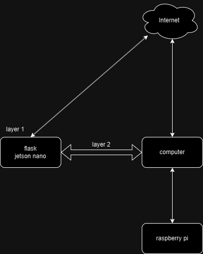

# 识身

一个基于flask与sqlalchemy的身份识别系统的web管理系统的后端接口
基于restful api理念开发，前后端分离
硬件端基于jetson nano与树莓派等设备开发，用于实现人物身份识别，包括:
1. 人脸识别 
2. 指纹识别
3. 声纹识别
4. 步态识别
web端（前、后端）均部署于jetson nano上

## 安装

1. 克隆该仓库
2. 查看config.py中的可修改选项，并进行自定义修改
3. 使用 `pip install -r requirements.txt`安装所需依赖.
4. 运行 `python run.py`以启动.

## 使用

访问 `http://localhost:8000`.

### 识别
逻辑上分为两层识别：
1. 人脸识别与指纹识别
2. 声纹识别与面部识别
其中，识别层一所依赖的代码与计算全部位于jetson nano上，而识别层二所需要的的代码运行于一台位于本地子网的高性能计算机上，其所依赖的硬件位于一台同样处于本地子网的树莓派设备上
因此，第二层识别需要web端发起请求后堵塞等待，手动启动二层识别的计算机上的脚本后，等待其结束识别过程

## 须知

在config.py中修改部分可修改参数，详细参数选项参见上述文件
本项目初始版本的网络拓扑图如下

## api文档

使用apifox管理api，公开文档于此
https://apifox.com/apidoc/shared-48e735ca-7888-4d61-854e-039a4cd559c2/api-156011616

## 开发文档

持续更新于个人博客中
http://139.224.245.251/backDev/ShiShenVerify.html